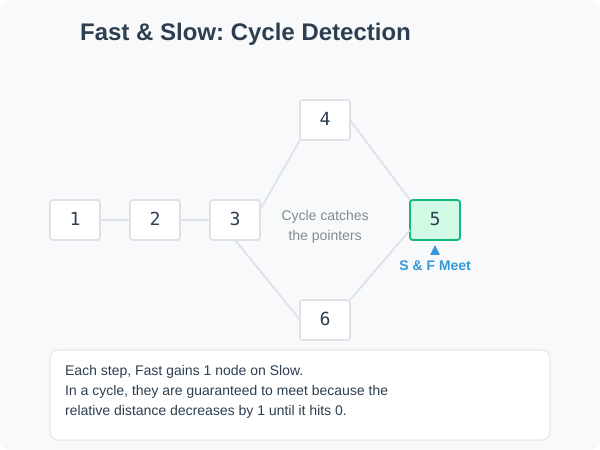

# Linked List Cycle

Given the head of a singly linked list, determine whether the list contains a cycle.

# Fast and Slow Family Map

Fast and slow pointers appeared earlier in the Same Direction section. The middle-of-linked-list problem used a 2:1 speed ratio, and remove-Nth-from-end used a fixed gap between pointers. In both cases, the goal was reaching a target position — the algorithm terminates when the fast pointer hits the end of the list.

Cycle finding introduces a different setting: traversal may never terminate on its own, and the goal shifts from locating a position to detecting whether a terminal state even exists.

## When This Pattern Applies
Reach for fast and slow pointers in this setting when a linked list might loop back to a node already visited. The key indicator is that you cannot rely on the fast pointer reaching `null` to stop. The problem in this section is [Linked List Cycle](https://algo.monster/problems/linked_list_cycle).

## Core Invariant
The invariant shifts from position to relative progress. Once both pointers are inside the cycle, the fast pointer gains exactly one step on the slow pointer each round. Because the cycle has a finite integer length, this gap closes by one step per round and must eventually reach zero — the two pointers meet.

If no cycle exists, the fast pointer reaches `null` before any meeting is possible, and the algorithm terminates normally.

The meeting itself is the signal. Compare this with Same Direction problems, where the answer was the specific position of the slow pointer when the fast pointer stopped.

## Approach
The sample implementation uses the Floyd's cycle detection approach with two pointers:



- A slow pointer moves one step at a time.
- A fast pointer moves two steps at a time.

If the linked list has a cycle, the fast pointer will eventually meet the slow pointer. If the fast pointer reaches the end of the list, then there is no cycle.

## Code
```cpp
class Solution {
public:
    bool hasCycle(ListNode *head) {
        ListNode *slow, *fast;

        if (head && head->next && head->next->next) {
            slow = head->next;
            fast = head->next->next;
        } else {
            return false;
        }

        while (fast != nullptr && fast->next != nullptr) {
            slow = slow->next;
            fast = fast->next->next;
            if (slow == fast) return true;
        }

        return false;
    }
};
```

## Time and Space Complexity
- Time complexity: O(n)
  - In the worst case, each pointer traverses the list once before either meeting or reaching the end.
- Space complexity: O(1)
  - Only a constant number of pointers are used, regardless of the list size.
