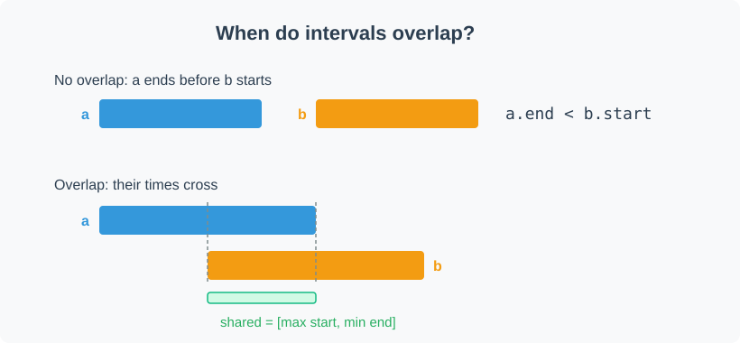
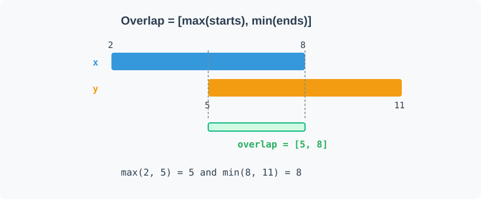

# Intervals

An interval is a pair `[start, end]` marking a stretch on a line: the minutes a meeting occupies, the range a task runs, the span a sensor was active. Interval problems hand you a list of these pairs and ask a question that comes down to how they sit relative to each other: do any two collide? What does the timeline look like once you merge everything that touches? How many rooms do you need so no two meetings share one?

Every one of those questions reduces to a single primitive: deciding whether two intervals overlap, and if they do, what part they share. Once that primitive is clear, the rest of the pattern is bookkeeping.

## When two intervals overlap

It is easier to state when two intervals do *not* overlap. Interval `a` sits entirely before interval `b` when `a` finishes before `b` begins, that is `a.end < b.start`. By symmetry they also miss each other when `b.end < a.start`. If neither of those holds, the intervals overlap.

Negating "`a.end < b.start` or `b.end < a.start`" gives the positive test directly: two intervals overlap exactly when

`a.start <= b.end && b.start <= a.end`.

That pair of comparisons is the whole overlap check.



If you have your own SVG, place it at `Templates/Intervals/overlap-condition.svg` (or update the file name in the image link above).

## The shared region

When two intervals do overlap, the part they share is itself an interval. Its start is the later of the two starts, and its end is the earlier of the two ends:

`[ max(a.start, b.start), min(a.end, b.end) ]`.

The overlap begins only once both intervals have started, and it ends the moment either one stops. This formula doubles as the overlap test: if `max(a.start, b.start) <= min(a.end, b.end)` the shared region is non-empty and the intervals overlap; if the max start exceeds the min end, there is no shared region.

## Overlap formula

In compact form the overlap condition and shared region are:

$$\text{overlap iff }\;\max(a.start,b.start) \le \min(a.end,b.end)$$

When the inequality holds the shared region is:

$$[\max(a.start,b.start),\;\min(a.end,b.end)].$$



## Sort by start first

Left unsorted, checking a list of intervals means comparing every pair, which is `O(n^2)`. Sorting the intervals by start time removes that cost. Once the list is in start order, any interval can only overlap ones that come after it and begin before it ends, so a single left-to-right pass is enough to merge, count, or detect collisions.

Sorting by start is the standard first line of almost every interval solution, and the problems below all lean on it. That gives the template every interval problem in this section builds on: sort by start, then sweep once, comparing each interval against the last one you kept.

## C++ template

```cpp
std::vector<std::vector<int>> intervalPattern(std::vector<std::vector<int>>& intervals) {
    // 1. Sort by start time
    std::sort(intervals.begin(), intervals.end(),
              [](const std::vector<int>& a, const std::vector<int>& b) { return a[0] < b[0]; });
    std::vector<std::vector<int>> result;
    for (auto& interval : intervals) {
        int start = interval[0], end = interval[1];
        // 2. Overlap with the last kept interval? start <= last.end
        if (!result.empty() && start <= result.back()[1]) {
            // Merge: extend the end of the last interval
            result.back()[1] = std::max(result.back()[1], end);
        } else {
            // 3. No overlap: keep this interval as-is
            result.push_back({start, end});
        }
    }
    return result;
}
```

## Where this pattern goes

The core problems build directly on the overlap primitive. `Merge Intervals` folds every overlapping group into one span. `Insert Interval` adds a new interval to an already-sorted list and re-merges. `Non-overlapping Intervals` and `Minimum Number of Arrows to Burst Balloons` turn overlap into a greedy choice about what to keep or remove, and `Meeting Rooms II` counts how many intervals are active at once. Each one is the same overlap test wrapped in a different question.

## Footnote

The positive overlap test comes straight from De Morgan's law. Negating `(a.end < b.start) or (b.end < a.start)` gives `(a.end >= b.start) and (b.end >= a.start)`, which is the `a.start <= b.end and b.start <= a.end` condition rewritten.
